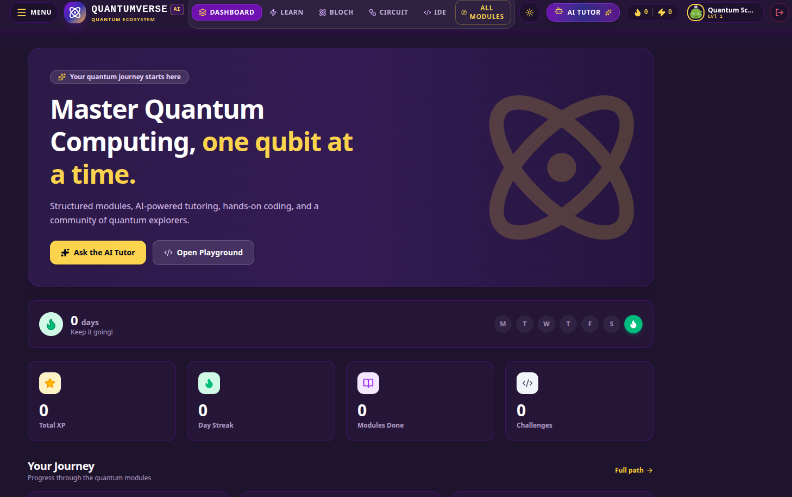
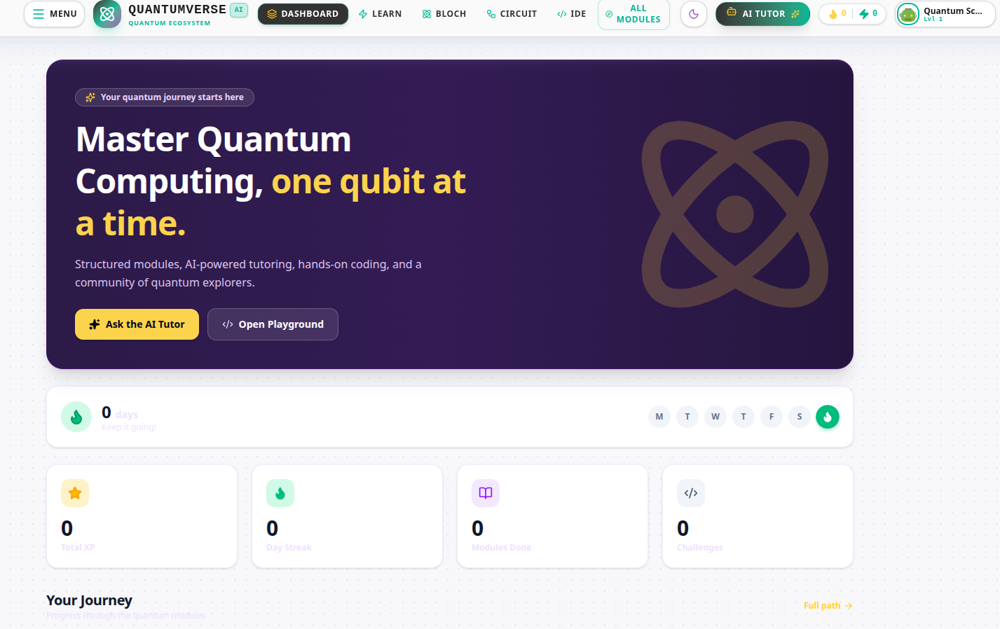
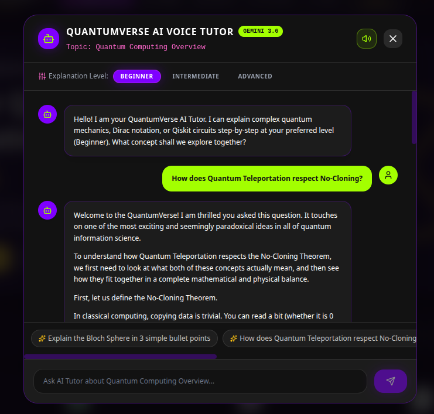
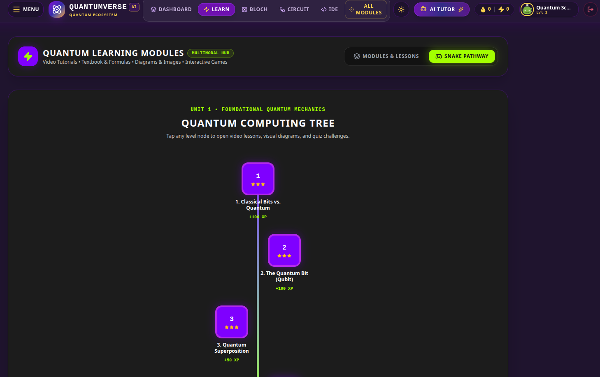
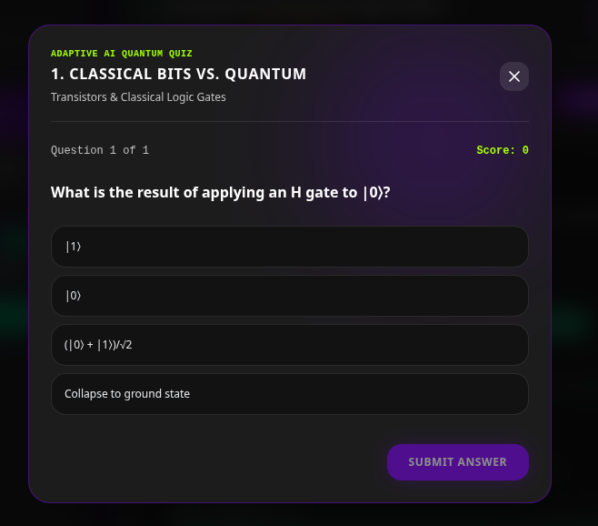

<div align="center">

# ⚛️ QEdus AI

### AI-Powered Quantum Computing Learning Platform

Learn Quantum Computing through Artificial Intelligence, interactive visualizations, adaptive learning paths, and personalized tutoring.

<p align="center">

<a href="https://qedusai.vercel.app">

</a>

<a href="https://github.com/YOUR_USERNAME/YOUR_REPOSITORY">

</a>


</p>

---

## 🌐 Live Website

### https://qedusai.vercel.app

---

*Making Quantum Computing Education Simple, Personalized and Interactive.*

</div>

---

# 📖 About

QEdus AI is an AI-powered learning platform that transforms how students learn Quantum Computing.

Traditional learning resources often require strong mathematical backgrounds and prior programming experience, making it difficult for beginners to enter the field. QEdus AI bridges this gap by combining Artificial Intelligence with interactive learning tools to create a personalized educational experience.

The platform analyzes a learner's knowledge level, generates adaptive learning paths, provides AI-powered tutoring, conducts intelligent assessments, and visualizes quantum concepts through interactive simulations.

Whether you're a complete beginner or an advanced learner, QEdus AI helps you master Quantum Computing in a structured and engaging way.

---

# ✨ Features

## 🤖 AI Tutor

- Personalized learning assistance
- Context-aware explanations
- Instant doubt clarification
- Conversational learning

---

## 📚 Adaptive Learning Paths

- Personalized course roadmap
- Beginner to Advanced progression
- AI-generated recommendations
- Progress-based learning

---

## 📝 Smart Assessments

- Diagnostic tests
- Adaptive quizzes
- Instant evaluation
- Performance analytics

---

## ⚛️ Interactive Quantum Visualizations

- Bloch Sphere
- Quantum Circuit Viewer
- Quantum Gates
- State Vector Visualization

---

## 📈 Progress Dashboard

- Learning analytics
- Completion tracking
- Skill progression
- Performance reports

---

## 🔍 Knowledge Assessment

Evaluate learners before starting the course to recommend the most suitable learning path.

---

## 📱 Responsive Design

Optimized for

- Desktop
- Tablet
- Mobile

---

# 🏗 System Architecture

```text
                    ┌──────────────────────────┐
                    │          User            │
                    └────────────┬─────────────┘
                                 │
                                 ▼
                  ┌────────────────────────────┐
                  │ React + TypeScript + Vite  │
                  └────────────┬───────────────┘
                               │
                               ▼
                    Firebase Authentication
                               │
                               ▼
                  ┌──────────────────────────┐
                  │      AI Learning Core    │
                  └────────────┬─────────────┘
                               │
        ┌──────────────────────┼──────────────────────┐
        ▼                      ▼                      ▼
   AI Tutor             Adaptive Quiz          Learning Path
        │                      │                      │
        └──────────────────────┼──────────────────────┘
                               ▼
                  Quantum Visualization Engine
                               │
                               ▼
                     Firebase Firestore Database
```

---

# 🛠 Technology Stack

| Category | Technology |
|-----------|------------|
| Frontend | React |
| Language | TypeScript |
| Build Tool | Vite |
| Backend | Node.js |
| Database | Firebase Firestore |
| Authentication | Firebase Authentication |
| Hosting | Vercel |
| Package Manager | Bun |
| Version Control | Git & GitHub |

---

# 📂 Project Structure

```text
QEdus-AI/
│
├── assets/
│
├── src/
│   ├── components/
│   ├── pages/
│   ├── hooks/
│   ├── services/
│   ├── utils/
│   ├── App.tsx
│   └── main.tsx
│
├── .env.example
├── .gitignore
├── bun.lock
├── firebase-applet-config.json
├── firebase-blueprint.json
├── firestore.rules
├── index.html
├── metadata.json
├── package.json
├── server.ts
├── tsconfig.json
├── vite.config.ts
└── README.md
```

---

# 🚀 Getting Started

## Clone Repository

```bash
git clone https://github.com/YOUR_USERNAME/YOUR_REPOSITORY.git
```

Move into the project

```bash
cd YOUR_REPOSITORY
```

---

## Install Dependencies

Using Bun

```bash
bun install
```

or using npm

```bash
npm install
```

---

## Start Development Server

```bash
bun run dev
```

or

```bash
npm run dev
```

---

## Build for Production

```bash
bun run build
```

---

## Preview Production Build

```bash
bun run preview
```

---

# 🌍 Deployment

The application is deployed on **Vercel**, enabling automatic deployments, global CDN distribution, HTTPS, and continuous integration directly from GitHub.

### Live Demo

https://qedusai.vercel.app

---

# 🔐 Environment Variables

Create a `.env` file in the project root.

```env
VITE_FIREBASE_API_KEY=

VITE_FIREBASE_AUTH_DOMAIN=

VITE_FIREBASE_PROJECT_ID=

VITE_FIREBASE_STORAGE_BUCKET=

VITE_FIREBASE_MESSAGING_SENDER_ID=

VITE_FIREBASE_APP_ID=
```

---

# 📸 Screenshots

## Home Page

> 

---

## Dashboard

> 

---

## AI Tutor

> 

---

## Learning Path

> 

---

## Adaptive Quiz

> 

---

# 🎯 Roadmap

- ✅ Authentication
- ✅ Personalized Learning
- ✅ AI Tutor
- ✅ Adaptive Quiz
- ✅ Progress Dashboard
- 🚧 Quantum Circuit Simulator
- 🚧 Bloch Sphere Visualization
- 🚧 IBM Quantum Integration
- 🚧 AI Voice Tutor
- 🚧 Community Discussion Forum
- 🚧 Certificates
- 🚧 Gamification
- 🚧 Leaderboards

---

# 📊 Current Status

| Module | Status |
|----------|---------|
| Authentication | ✅ Complete |
| Dashboard | ✅ Complete |
| AI Tutor | ✅ Complete |
| Learning Paths | ✅ Complete |
| Quiz Module | ✅ Complete |
| Firebase Integration | ✅ Complete |
| Quantum Visualizations | 🚧 In Progress |
| IBM Quantum Support | 🚧 Planned |

---

# 🤝 Contributing

Contributions are welcome.

1. Fork this repository.

2. Create a feature branch.

```bash
git checkout -b feature-name
```

3. Commit your changes.

```bash
git commit -m "Added new feature"
```

4. Push your branch.

```bash
git push origin feature-name
```

5. Open a Pull Request.

---

# 📜 License

This project is licensed under the **MIT License**.

---

# 👨‍💻 Developer

**Sharavana Kumar**

Electronics Engineering (VLSI Design & Technology)

Quantum Computing Enthusiast

AI & Full-Stack Developer

GitHub:

https://github.com/Sharavana864

---

# 💡 Vision

Our vision is to make Quantum Computing education accessible, interactive, and engaging for learners worldwide by combining Artificial Intelligence with modern educational technologies.

---

# ⭐ Support

If you found this project useful,

⭐ Star this repository

🍴 Fork it

🛠 Contribute

📢 Share it with others

---

<div align="center">

## ⚛️ QEdus AI

### Learn Quantum Computing Smarter with Artificial Intelligence

Made with ❤️ by Sharavana Kumar

</div>
